# Pesquisa de Opinião - Empresa TudoWeb 📊

Atividade prática desenvolvida para a disciplina de Lógica de Programação e Algoritmos.

## 📝 Descrição da Atividade
O programa foi desenvolvido em **Python** utilizando a técnica de programação estruturada, com laço de repetição contínuo (`while`), estruturas de decisão (`if/elif/else`) e tratamento de exceções (`try/except`).

Ele simula um sistema de coleta de opinião dos clientes da empresa **TudoWeb** sobre a qualidade do atendimento prestado.

### ⚙️ Funcionalidades do Sistema:
- **Fluxo Contínuo:** O programa pergunta ao final de cada atendimento se o usuário deseja cadastrar uma nova opinião (`S` para Sim / `N` para Não).
- **Validação de Entradas:**
  - **Idade:** Aceita apenas números inteiros maiores que zero. Caso o usuário digite texto ou caracteres inválidos, o sistema exibe uma mensagem de erro e solicita a digitação novamente.
  - **Opinião:** Aceita estritamente as opções `1` (EXCELENTE), `2` (BOM) ou `3` (RUIM).
  - **Continuação:** Aceita apenas `S` ou `N`.
- **Relatório Final:** Ao encerrar a pesquisa, exibe o total de pessoas entrevistadas e a contagem de respostas "EXCELENTE" e "RUIM".

---

## 🛠️ Tecnologias e Conceitos
- **Linguagem:** Python 3
- **Conceitos Aplicados:** Laços de Repetição (`while`), Estruturas de Decisão (`if / elif`), Tratamento de Exceções (`try / except`), Validação de Dados, Variáveis Contadoras e Métodos de String (`strip()`, `upper()`).

---

## 💻 Print do Código Fonte


---

## 📸 Testes de Execução e Validações (10 Entrevistados)

Abaixo estão registradas as capturas de tela demonstrando o funcionamento dos ciclos de entrevista, validações de erro e a confirmação de parada:

### Entrevistados 1 a 5
| Entrevistado / Teste | Print da Execução |
| :---: | :--- |
| **01** | 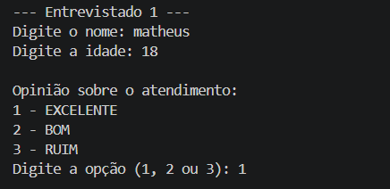 |
| **02** | 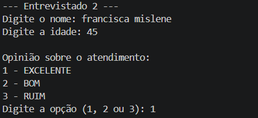 |
| **03** | 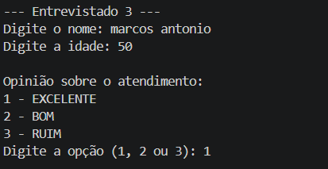 |
| **04** | 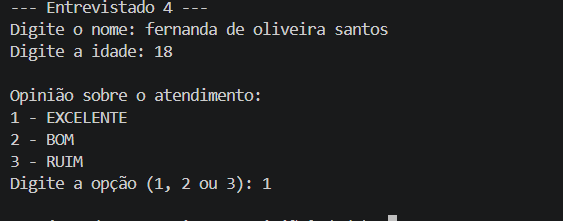 |
| **05** | 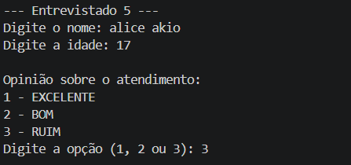 |

### Entrevistados 6 a 10
| Entrevistado / Teste | Print da Execução |
| :---: | :--- |
| **06** | 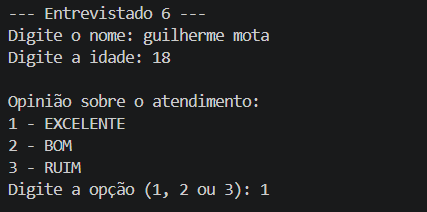 |
| **07** | 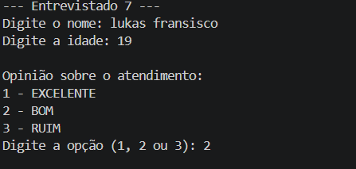 |
| **08** | 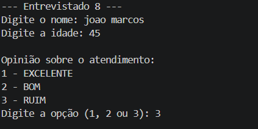 |
| **09** | 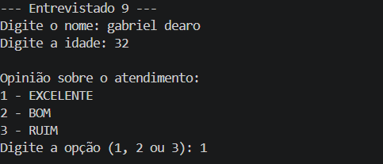 |
| **10** | 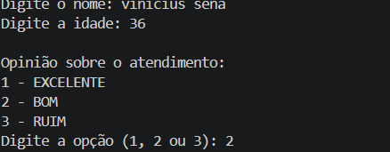 |

---

### 📊 Resultado Final e Encerramento da Pesquisa

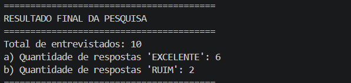

---

## 🚀 Como Executar o Projeto

1. Certifique-se de ter o Python 3 instalado na sua máquina.
2. Clone este repositório ou faça o download dos arquivos:
   ```bash
   git clone (https://github.com/matheusaafranco-cpu/pesquisa-opiniao-tudoweb)